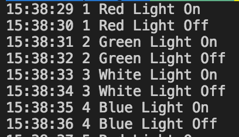

# Lights

A program that prints out the current time and a light chosen from a set of lights which are turned on/off sequentially
until the program is halted.

## How to use

compile the program:

```
javac Main.java
```

Run the program:

```
java Main [number of lights]
```

By default the program will use 20 lights

## Sample output


